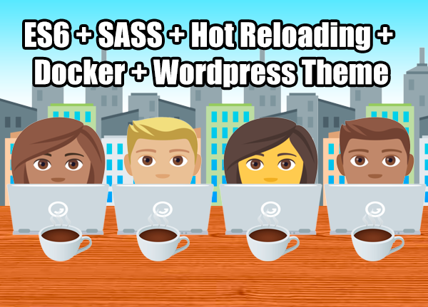

# ES6 + SASS + Hot Reloading + Docker + Wordpress Theme

### "Theme" - The Great Blank

A quick start _blank_ template for wordpress with a bunch of development features.

### ⚠️ Warning

I've created this for myself so it will inevitably lack something you need, and for that I can only apologise and encourage you to contribute in the form of creating a PR or raising an issue.

### 📄 Instructions

You will need [node.js](https://nodejs.org/en/), [yarn](https://yarnpkg.com/en/), and [docker](https://docs.docker.com/compose/install/) installed in order to use this.

#### Install Dependencies

`yarn install`

#### Run wordpress server and/or wordpress installation

`yarn server:up`

#### Stop wordpress server

`yarn sever:down`

#### Delete wordpress and database

`yarn server:wipe`

#### Development

Launches browser window with hot reloading.

`yarn dev`

### Build

Builds everything and dumps it in `./dist`

`yarn build`
